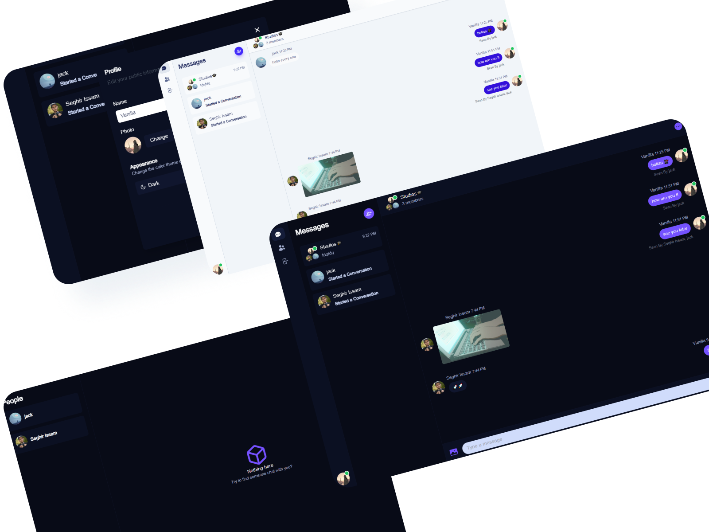
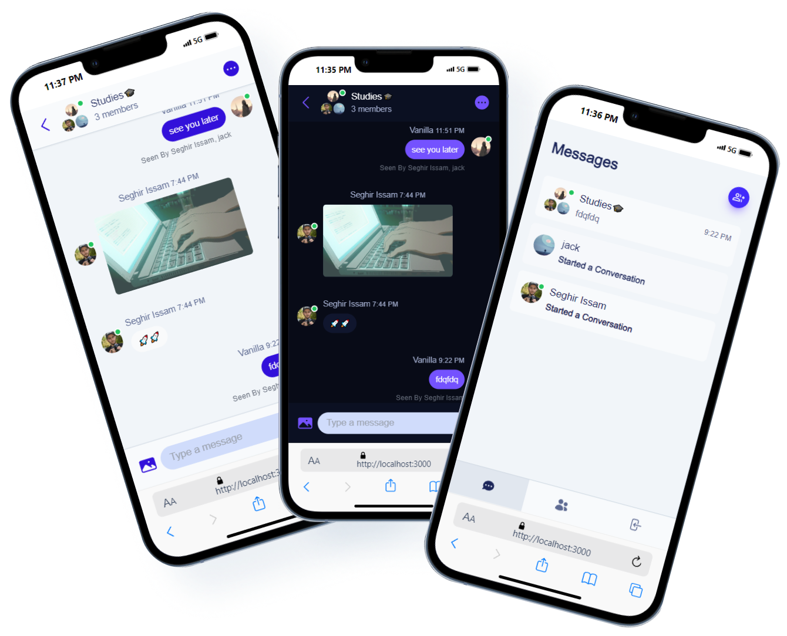

<div align="center">


<h1 align="center" >ChatWhizz</h1>


[](https://choosealicense.com/licenses/mit/)


  <p align="center">

  **ChatWhizz | A Real Time Chat Application Powered by Next.js, Pusher**
  Include **Group** **chats** and one-on-one **messaging** , real time **notification** , **profile** management .
    <br />
    <br />
    <a href="https://chat-whizz-production-e15b.up.railway.app/">View Demo</a>
    .
    <a href="https://github.com/issam-seghir/chat-whizz/issues">Report Bug</a>
    .
    <a href="https://github.com/issam-seghir/chat-whizz/pulls">Request Feature</a>
  </p>

<br>
<hr>

</div>

<br>





### Built With

- 
- 
- 
- 
- 
- 
- 
- 
- 

## Features

- 🔒 **Authentication + Google/Github Auth** With **NextAuth**
- 🎉 **Server** **creation** and customization
- 📱 **Real-time** messaging using **Pusher**
- 🚀 **Conversation** between members
- 📌 **Message** **notifications** and alerts
- 🌐 **Online**/**offline** user **status**
- 📨 Group chats and one-on-one messaging
- 👤 User profile customization and settings
- ✨ **Creating** and **managing** **chat** rooms and **channels**
- 🎁 **Send** **attachments & Images** as messages using **Cloudinary**
---
- 🧨 **Delete** & **Edit** messages in **real time** for all users
- 🔍 **Search** **Command Line** Functionality
- 🎨 **Theme Toggler** (Light /Dark mode)
- 🚀 **Optimized SEO and Performance**: The project is optimized for SEO and performance using the latest Next.js features and best practices for **meta** tags and **Next/Image** && **site maps**.
- 🎊 **Responsive Design**


## Getting Started

First, run the development server:

1. Clone or Fork the repo

   ```sh
   git clone https://github.com/issam-seghir/discord-clone.git
   cd ./your_project
   ```

2. Install Dependencies

   ```sh
   npm install
   ```

3. rename `.env.example` file to `.env`

4. Start the server

    ```sh
    npm run dev
    ```

Open [http://localhost:3000](http://localhost:3000) with your browser to see the result.

You can start editing the page by modifying `app/page.tsx`. The page auto-updates as you edit the file.

## Deploy on Vercel

The easiest way to deploy your Next.js app is to use the [Vercel Platform](https://vercel.com/new?utm_medium=default-template&filter=next.js&utm_source=create-next-app&utm_campaign=create-next-app-readme) from the creators of Next.js.

Check out our [Next.js deployment documentation](https://nextjs.org/docs/deployment) for more details.

<!-- CONTRIBUTING -->
## Contributing

Contributions are what make the open source community such an amazing place to learn, inspire, and create. Any contributions you make are **greatly appreciated**.

If you have a suggestion that would make this better, please fork the repo and create a pull request. You can also simply open an issue with the tag "enhancement".
Don't forget to give the project a star! Thanks again!

1. Fork the Project
2. Create your Feature Branch (`git checkout -b feature/AmazingFeature`)
3. Commit your Changes (`git commit -m 'Add some AmazingFeature'`)
4. Push to the Branch (`git push origin feature/AmazingFeature`)
5. Open a Pull Request

<!-- LICENSE -->
## License

Distributed under the MIT License. See `LICENSE.txt` for more information.


## State

[](https://starchart.cc/issam-seghir/discord-clone)


## Support Me

<a href="https://www.buymeacoffee.com/issam.seghir" target="_blank"></a>
</div>
